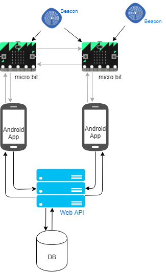
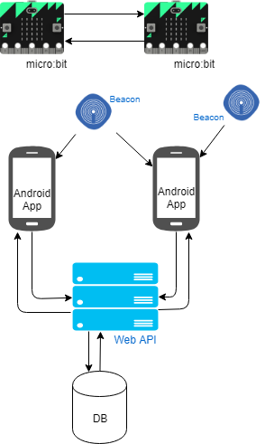

# XP 2018 APP

Android app developed by Software Systems Architecture (ASSO) students from the Faculty of Engineering from Porto University (FEUP).

This application is designed to be used by the XP 2018 Conference participants and speakers.

## Features
- User location traceability via bluetooth
- Schedule of the event
- Custom notifications of the upcoming events

## How to install it
The app is not published in any Android market but you can download it by [**CLICKING HERE**](https://github.com/telmobarros/xp-2018-android/raw/master/app/release/xp2018.apk) or scanning the QR Code below. You will also need to allow the "Unkown sources" definition in your device, in case it is not already enabled.

## How to use it
### 1. Register
In case this is the first time using the app, you need to allow the following permissions: location, bluetooth and storage access. These permissions will allow you to enjoy the app to the fullest.

After that, you will need to register in the app.

Otherwise you will only have access to the schedule feature and the other sub-menus will appear protected by the login page, like this:

 

### 2. Home

In the home view you are able to see the layout of the conference space and marked with green/gray dots the bluetooth devices locations that are helping to keep track of your location. When you are near of one of these devices it will apear green and with a blue circle around that is as big as the power of the bluetooth signal.

 

### 3. Schedule

In the schedule view you are able to see the schedule of the event and search for speakers or a specific speech. This view is totally powered by [SCHED](https://sched.com/), although we added the download offline version of the schedule in the sidebar.

 

### 4. User

In the user view you are able to see the information you have entered while registering. This is also where you find the logout button.

### 5. Notifications

When an event is approaching you will also receive a notification so you can attend to it if you want.

### 6. Micro:bit

One button that is always in the upper right corner is the [micro:bit](http://microbit.org/) button, It will redirect you to the [micro:bit app](https://play.google.com/store/apps/details?id=com.samsung.microbit) so you can play with it by flashing your own code.

## Architecture
### The system as whole
The image below represent the initial architecture of the whole system. The three main components are the micro:bit's, this app and the backend API.

During the implementation of the system we found some technical/physical limitations, particularly with the connections gray colored. 

Essentially the micro:bit's don't allow to mantain a bluetooth and a radio connection at the same time. The radio is used to interact with others micro:bit's and bluetooth was used in the detection of the beacons and connection with the app.

Due to this we had to rearrange the part of the structure and that is the one represent below.

The main differences are that now the micro:bit's only interact with themselves via radio and the beacon detection and the source of outputs to the user is done through the app.

### Packages
- **backgroundServices**

  In this package are all the services that are started during the application startup or later after detecting internet connection and that run in background.
    - BeaconQueuePopService
    
      Queue that handles beacon events requests and ensures that every request get to its destination even if the user is not connected to the internet at some time.
    - BeaconQueuePopService
    
      Service that seeds the BeaconQueue with requests to be sent to the API.
    - BluetoothService
    
      Service that detects nearby bluetooth devices.
    - NetworkChangeReceiver
    
      Service that handles changes in network adapter (Wi-Fi and mobile data state).
    - NotificationService
    
      Service that sets the notifications to popup before every event.
      
- **bluetooth**
    - BluetoothDevice
    
      Abstraction of the BluetoothDevice class offered by Java, by including only the necessary attributes to display in the view and to send to the API.
      
- **common**
  This package includes utility methods to the web services.
    - Consumer
    - MoshiConverter
    - Wrapper
      
- **db**
  This package includes database models and methods used to manipulate the information in a SQLite offline database.
    - AuthDBModel
    
      Model of the table that stores the authentication tokens to request the API.
    - BeaconQueue
    
      Queue of the beacon events requests, this information is stored in a separate file and not in the database to ensure higher access speed.
    - UserDBModel
    
      Model of the table that stores the users information.
      
- **mainPage**
  This package includes the views fragments that compose the application.
    - BrowserFragment
    
      Fragment of the "Schedule" section.
    - HomePageFragment
    
      Fragment of the "Home" section.
    - LoginFragment
    
      Fragment of the login section.
    - ModelObject
    - UserPageFragment
    
      Fragment of the "User" section.
      
- **webClient**
  This package includes the views fragments that compose the application.
    - **models**
    This package includes the models used in every request.
      - AuthModel
      - BeaconModel
      - BluetoothDeviceModel
      - EventModel
      - LoginDataModel
      - ResponseModel
      - UserModel
    - BookmarkCallback
    - GithubService
    
      Endpoints to github where the bluetooth devices and sessions information is kept.
    - UserService
    
      HTTP requests implementation
    - WebClientService
    
      Endpoints to the API.

- HomeActivity

  Main app activity that handles everything on startup.

## Authors
- Adam Krzysztof Jakomulski
- Marwa Boufalgha
- Telmo João Vales Ferreira Barros
