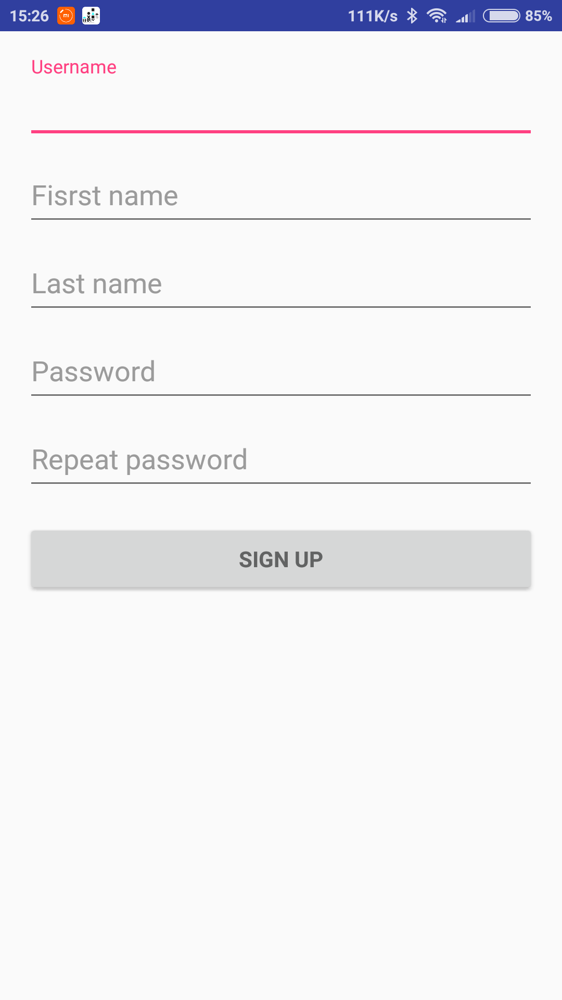
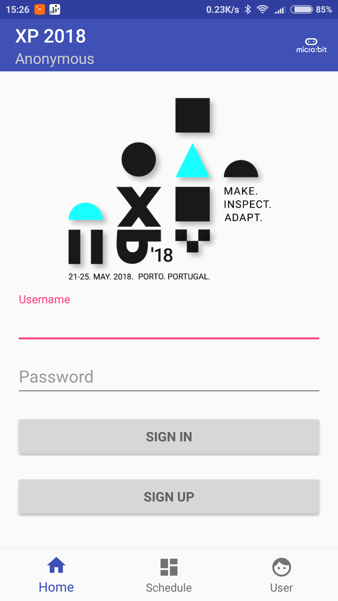
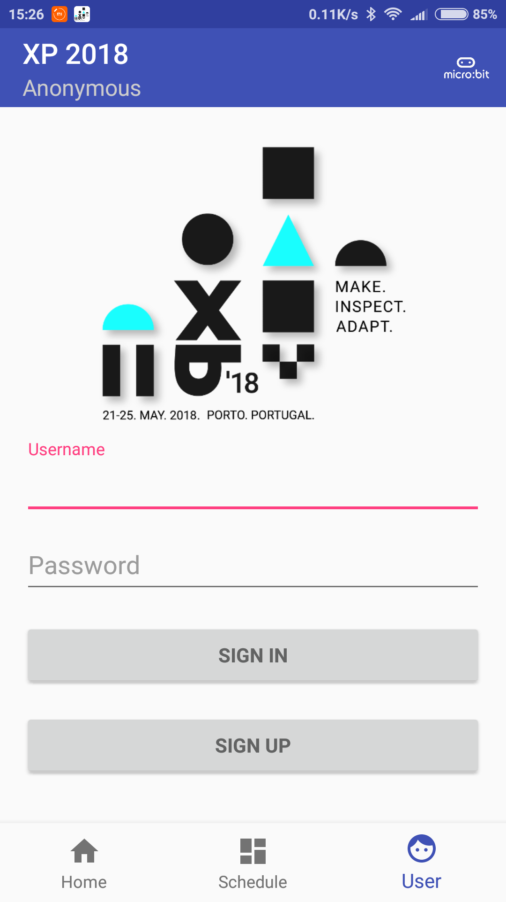
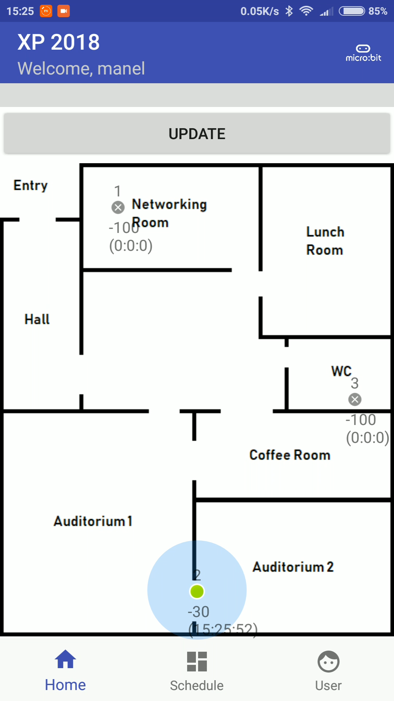
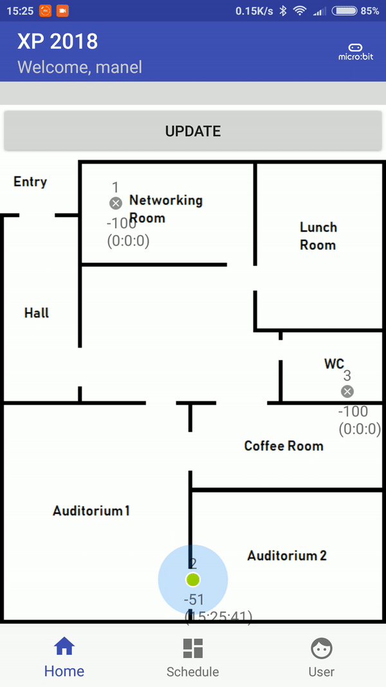
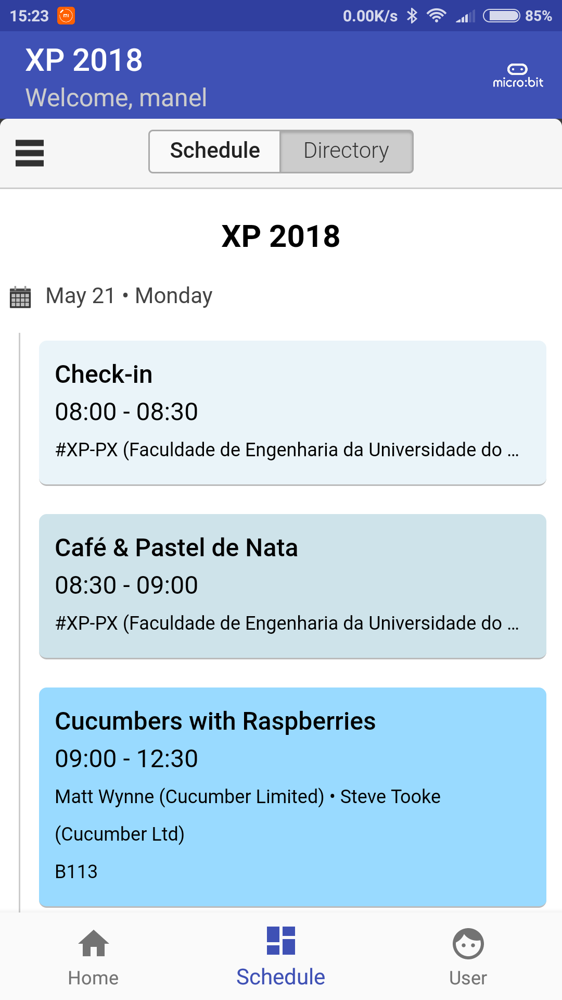
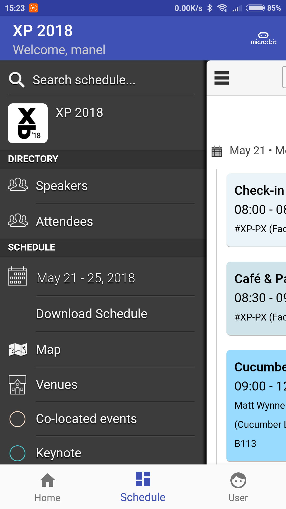
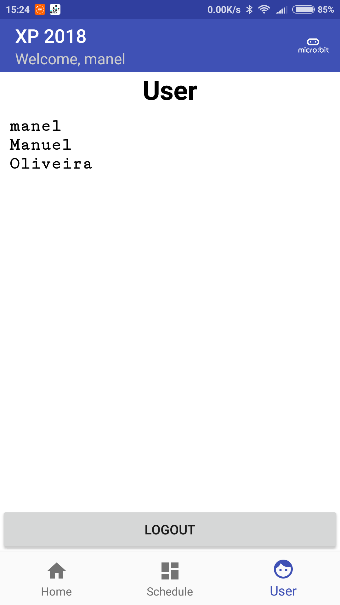
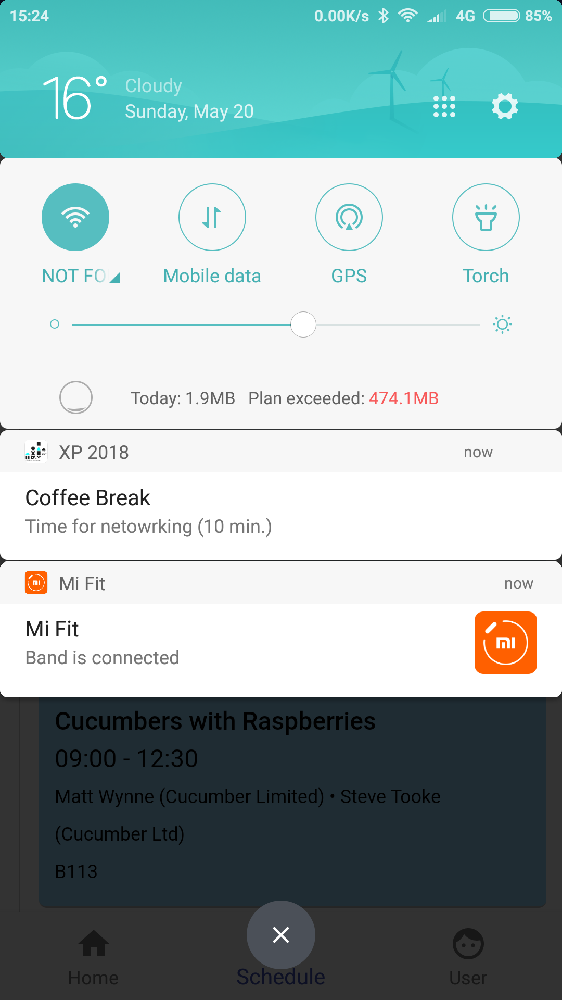
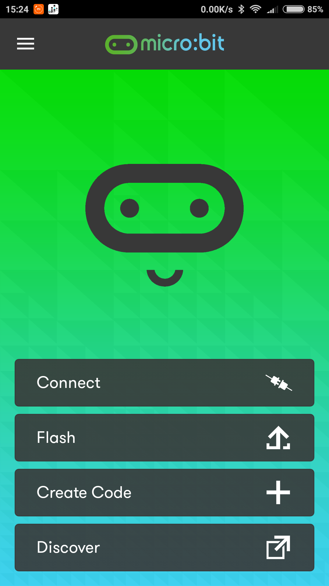

# XP 2018 CONFERENCE APP

Android app developed by Software Systems Architecture (ASSO) students from the Faculty of Engineering from Porto University (FEUP).

This application is designed to be used by the XP 2018 Conference participants and speakers.

## Features
- User location traceability via bluetooth
- Schedule of the event
- Custom notifications of the upcoming events

## How to use it
### 1. Register
In case this is the first time using the app, you need to allow the following permissions: location, bluetooth and storage access. These permissions will allow you to enjoy the app to the fullest.

After that, you will need to register in the app.

Otherwise you will only have access to the schedule feature and the other sub-menus will appear protected by the login page, like this:

 

### 2. Home

In the home view you are able to see the layout of the conference space and marked with green/gray dots the bluetooth devices locations that are helping to keep track of your location. When you are near of one of these devices it will apear green and with a blue circle around that is as big as the power of the bluetooth signal.

 

### 3. Schedule

In the schedule view you are able to see the schedule of the event and search for speakers or a specific speech. This view is totally powered by [SCHED](https://sched.com/), although we added the download offline version of the schedule in the sidebar.

 

### 4. User

In the user view you are able to see the information you have entered while registering. This is also where you find the logout button.

### 5. Notifications

When an event is approaching you will also receive a notification so you can attend to it if you want.

### 6. Micro:bit

One button that is always in the upper right corner is the [micro:bit](http://microbit.org/) button, It will redirect you to the [micro:bit app](https://play.google.com/store/apps/details?id=com.samsung.microbit) so you can play with it by flashing your own code.

## The system as whole
...

## Architecture

### Packages
...

## Authors
- Adam Krzysztof Jakomulski
- Marwa Boufalgha
- Telmo João Vales Ferreira Barros
